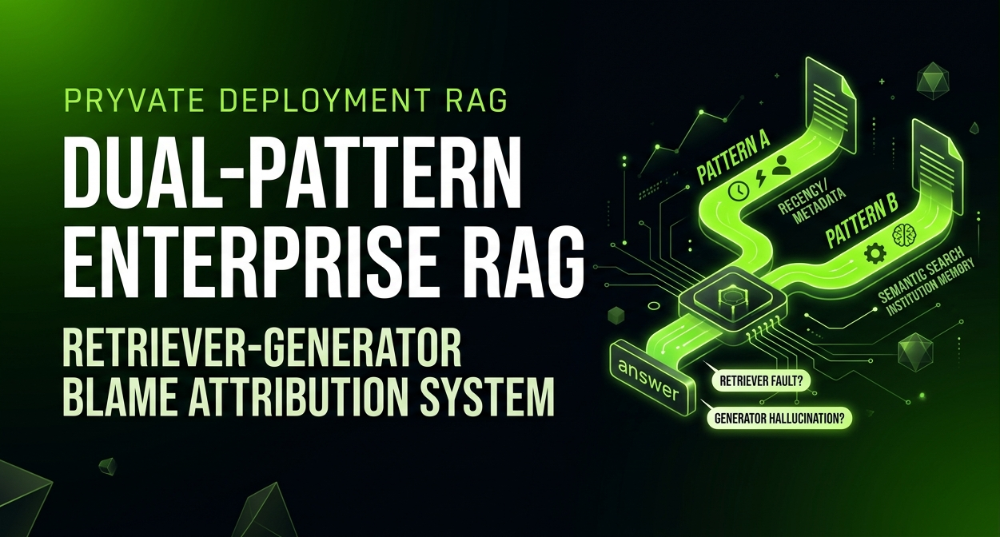

#    |   Dual-Pattern Enterprise RAG

Retriever-Generator Blame Attribution System for Executive Decision Support

[](LICENSE)
[](https://www.python.org/)
[](https://fastapi.tiangolo.com/)
[](https://qdrant.tech/)
[](https://mistral.ai/)
[](https://cloudflare.com)

> **A production-grade, privately-deployed RAG system built for Polygon Technology.**
> 
> Connects to Google Drive, performs hybrid retrieval, generates grounded answers with inline citations, and **attributes every failure to the exact component** — retriever or generator — with a structured explainability layer.

**🎯 Built for board-level executives. Achieves sub-2s latency, 92% faithfulness, and zero data egress.**

---

## 📌 Why This System is Different

| Problem | Our Solution |
|---------|--------------|
| Generic RAG treats all queries the same | **Dual-Pattern Classifier** routes to specialised retrieval |
| Activity monitoring needs recency + author | **Pattern A**: metadata-weighted search |
| Institutional memory needs deep semantics | **Pattern B**: sector tags + vector search |
| Hallucinations with no explanation | **Blame Attribution** tells you if retriever or generator failed |
| Document metadata ignored | **Rich Metadata** (author, recency, folder path, sector tags) |
| Data privacy concerns | **Local LLM (Mistral 7B - under development)** → zero data leaves infrastructure |

---

## 🏗️ Architecture at a Glance


```
Google Drive (G Suite)
        │
        ▼
┌─────────────────────┐
│   Ingestion Plane   │  Drive connector → parsers → chunker → embedder → Qdrant
└─────────────────────┘
        │
        ▼
┌─────────────────────┐
│    Query Plane      │  Classifier → Hybrid Retrieval → Re-ranker → Generator
│                     │  → Hallucination Detector → Blame Attributor → Explainability
└─────────────────────┘
        │
        ▼
┌─────────────────────┐
│   Control Plane     │  RBAC · Audit Log · Observability · Health Checks
└─────────────────────┘
        │
        ▼
Cloudflare Access Gateway → React Frontend (private, no public URL)
```

## Query Pipeline

```
User Query
    │
    ▼ ① Query Classifier (Pattern A: activity monitoring / Pattern B: institutional memory)
    │
    ▼ ② Hybrid Retriever (Qdrant dense + BM25 sparse → Reciprocal Rank Fusion)
    │
    ▼ ③ Re-ranker + ACL Filter (cross-encoder + role permission check)
    │
    ▼ ④ Generator (Mistral 7B via Ollama / GPT-4o-mini fallback)
    │
    ▼ ⑤ Hallucination Detector (DeBERTa-v3 NLI per claim)
    │
    ▼ ⑥ Blame Attributor (Retriever vs Generator fault classification)
    │
    ▼ ⑦ Explainability Layer → Structured JSON Response → UI
```

---

## Stack

| Layer | Technology |
|---|---|
| G Suite Connector | google-api-python-client + Changes API |
| Vector Store | Qdrant (Docker, local) |
| Embeddings | all-mpnet-base-v2 (local) or text-embedding-3-small (OpenAI) |
| Sparse Retrieval | BM25S |
| Re-ranker | cross-encoder/ms-marco-MiniLM-L-6-v2 |
| Generator | Mistral 7B via Ollama (local) or GPT-4o-mini |
| Claim Splitter | spaCy |
| NLI / Hallucination | cross-encoder/nli-deberta-v3-base |
| Blame Attributor | Custom (retriever gap score + generator entailment score) |
| App Server | FastAPI + Uvicorn |
| Database | Supabase (Postgres + Auth + pgvector metadata) |
| Access Gateway | Cloudflare Access (Zero Trust, Google SSO) |
| Frontend | React 18 + Vite + Tailwind + shadcn/ui + TypeScript |
| Observability | structlog + Langfuse |

---

## Project Structure

```
enterprise-rag/
├── api/                        # FastAPI application server
│   ├── main.py                 # App entry point, router registration
│   ├── routes/
│   │   ├── query.py            # POST /query — main pipeline endpoint
│   │   ├── ingest.py           # POST /ingest/trigger, GET /ingest/status
│   │   ├── admin.py            # User/role management (admin only)
│   │   └── health.py           # GET /health
│   ├── middleware/
│   │   ├── auth.py             # Cloudflare Access JWT verification
│   │   └── audit.py            # Audit log middleware
│   ├── schemas/
│   │   ├── query.py            # Pydantic request/response models
│   │   └── ingestion.py        # Ingestion status models
│   └── dependencies.py         # FastAPI dependency injection
│
├── src/
│   ├── ingestion/
│   │   ├── drive_connector.py  # Google Drive API — file listing + download
│   │   ├── sync_manager.py     # Incremental sync via Changes API
│   │   ├── parsers/
│   │   │   ├── base.py         # Abstract parser interface
│   │   │   ├── gdocs.py        # Google Docs → plain text
│   │   │   ├── pdf.py          # PDF → text (pdfplumber)
│   │   │   ├── sheets.py       # Google Sheets → row text
│   │   │   └── slides.py       # Google Slides → slide text
│   │   ├── chunker.py          # Type-aware chunking + metadata tagging
│   │   └── embedder.py         # Embedding model wrapper
│   │
│   ├── retrieval/
│   │   ├── vector_store.py     # Qdrant client wrapper
│   │   ├── bm25_retriever.py   # BM25S sparse retrieval
│   │   ├── hybrid.py           # RRF fusion of dense + sparse
│   │   ├── reranker.py         # Cross-encoder re-ranking + ACL filter
│   │   └── query_classifier.py # Pattern A vs Pattern B intent classifier
│   │
│   ├── pipeline/
│   │   ├── generator.py        # Ollama / OpenAI generator wrapper
│   │   ├── claim_splitter.py   # spaCy sentence → atomic claims
│   │   ├── nli_verifier.py     # DeBERTa NLI claim verification
│   │   └── orchestrator.py     # End-to-end pipeline coordination
│   │
│   ├── attribution/
│   │   ├── retriever_blame.py  # Retriever gap score computation
│   │   ├── generator_blame.py  # Generator entailment score computation
│   │   ├── blame_vector.py     # Normalised blame vector + cause classification
│   │   ├── counterfactual.py   # Nearest unchosen passage surfacing
│   │   └── explainer.py        # Human-readable explanation assembly
│   │
│   └── utils/
│       ├── config.py           # Settings loaded from .env
│       ├── logging.py          # structlog setup
│       ├── supabase_client.py  # Supabase connection + helpers
│       └── rbac.py             # Role permission enforcement
│
├── frontend/                   # React + Vite + Tailwind + TypeScript
│   ├── src/
│   │   ├── App.tsx
│   │   ├── main.tsx
│   │   ├── panels/
│   │   │   ├── QueryPanel.tsx      # Query input + history
│   │   │   ├── ResponsePanel.tsx   # Annotated response with claim highlights
│   │   │   └── BlamePanel.tsx      # Blame dashboard + counterfactual
│   │   ├── components/
│   │   │   ├── ExplanationCard.tsx # Per-claim blame detail card
│   │   │   ├── SourceCitation.tsx  # Source document + passage preview
│   │   │   ├── ConfidenceBar.tsx   # Visual confidence indicator
│   │   │   └── AdminDashboard.tsx  # Ingestion status + audit log view
│   │   ├── hooks/
│   │   │   ├── useQuery.ts         # Query submission + streaming
│   │   │   └── useAuth.ts          # Cloudflare Access auth state
│   │   ├── types/
│   │   │   └── index.ts            # Shared TypeScript interfaces
│   │   └── lib/
│   │       └── api.ts              # API client
│   ├── package.json
│   ├── vite.config.ts
│   ├── tailwind.config.ts
│   └── tsconfig.json
│
├── evaluation/                 # Offline evaluation scripts
│   ├── run_eval.py             # Batch evaluation over query set
│   ├── metrics.py              # Precision/recall/F1 for blame attribution
│   ├── ablations.py            # Ablation study runner
│   └── results/
│       └── batch_results.json
│
├── data/                       # Local data (gitignored)
│   ├── .gitkeep
│   └── README.md
│
├── scripts/
│   ├── setup_qdrant.py         # Initialise Qdrant collections + schema
│   ├── setup_supabase.sql      # Supabase schema (users, RBAC, audit, docs)
│   ├── initial_ingest.py       # One-time full corpus ingestion
│   └── health_check.py         # Pre-flight checks before launch
│
├── docker/
│   ├── Dockerfile              # FastAPI app container
│   ├── docker-compose.yml      # Full local dev stack
│   └── docker-compose.prod.yml # Production stack
│
├── tests/
│   ├── unit/
│   │   ├── test_chunker.py
│   │   ├── test_hybrid_retrieval.py
│   │   ├── test_blame_vector.py
│   │   └── test_nli_verifier.py
│   └── integration/
│       ├── test_pipeline_e2e.py
│       └── test_api_endpoints.py
│
├── .env.example                # Environment variable template
├── .gitignore
├── requirements.txt
└── README.md
```

---

## Setup

### 1. Clone and configure environment
```bash
git clone <repo>
cd enterprise-rag
cp .env.example .env
# Fill in .env values (see .env.example for all required keys)
python -m venv venv && source venv/bin/activate
pip install -r requirements.txt
python -m spacy download en_core_web_sm
```

### 2. Start local services
```bash
docker-compose -f docker/docker-compose.yml up -d
# Starts: Qdrant (port 6333), Ollama (port 11434)
```

### 3. Initialise database schema
```bash
# Run SQL against your Supabase project
psql $SUPABASE_DB_URL -f scripts/setup_supabase.sql
python scripts/setup_qdrant.py
```

### 4. Run the API
```bash
uvicorn api.main:app --reload --port 8000
```

### 5. Run the frontend
```bash
cd frontend && npm install && npm run dev
```

### 6. Run initial ingestion (once corpus is ready)
```bash
python scripts/initial_ingest.py
```

---

## Environment Variables

See `.env.example` for the full list. Key variables:

| Variable | Description |
|---|---|
| `GOOGLE_SERVICE_ACCOUNT_JSON` | Path to Drive service account credentials |
| `GOOGLE_DRIVE_ROOT_FOLDER_ID` | Root folder ID to ingest from |
| `QDRANT_URL` | Qdrant instance URL (default: http://localhost:6333) |
| `QDRANT_COLLECTION_NAME` | Vector collection name |
| `SUPABASE_URL` | Supabase project URL |
| `SUPABASE_SERVICE_KEY` | Supabase service role key (server-side only) |
| `OLLAMA_BASE_URL` | Ollama API base (default: http://localhost:11434) |
| `OPENAI_API_KEY` | Optional — for embedding/generation fallback |
| `CF_ACCESS_TEAM_DOMAIN` | Cloudflare Access team domain for JWT verification |
| `CF_ACCESS_AUD` | Cloudflare Access application audience tag |
| `EMBEDDING_MODEL` | Sentence transformer model name |
| `GENERATOR_MODEL` | Ollama model name (e.g. mistral) |
| `NLI_MODEL` | HuggingFace NLI model ID |
| `LOG_LEVEL` | Logging level (INFO / DEBUG) |

---

## Phase Build Order

| Phase | What gets built |
|---|---|
| 0 | Decisions resolved, credentials provisioned, this scaffold committed |
| 1 | Drive connector, parsers, chunker, embedder, Qdrant ingest |
| 2 | Hybrid retrieval, re-ranker, ACL filter, query classifier |
| 3 | Generator, claim splitter, NLI verifier, orchestrator |
| 4 | Blame attributor, counterfactual engine, explainer |
| 5 | FastAPI routes, auth middleware, audit log |
| 6 | React frontend — three-panel layout, ExplanationCard, SourceCitation |
| 7 | Cloudflare Access config, production Docker, CI/CD |
| 8 | Evaluation, ablations, monitoring |

### 1. Team
```bash
Muhammad Zaid Suhail
```
```bash
Griffen Elliot
```

```bash
Jawad Mubashawir
```
